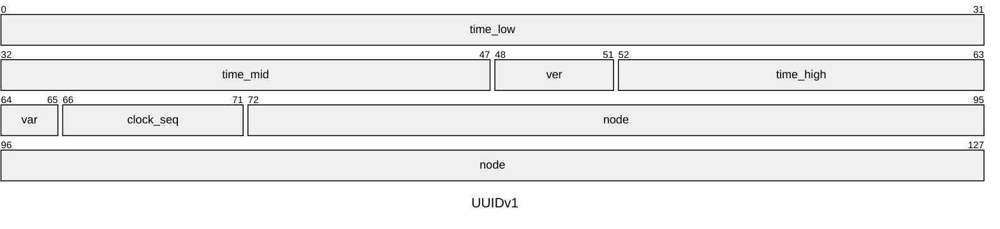
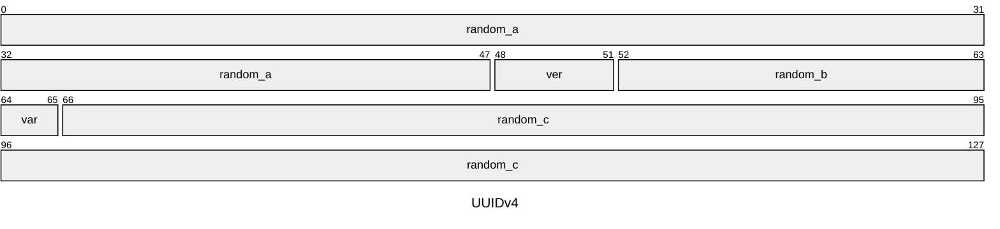
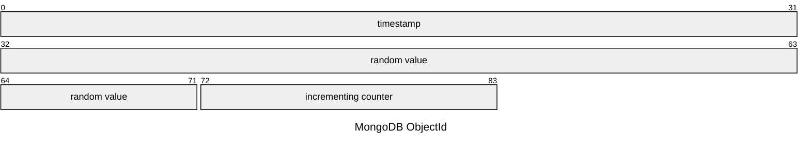
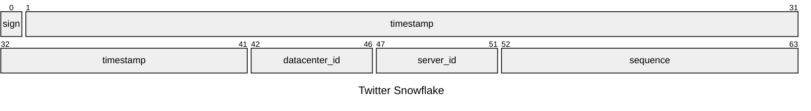

### 분산 시스템을 위한 UID

UID는 객체 집합에서 객체를 참조하기 위한 고유 식별자입니다. \
DB에서 ID 하면 auto-increment 또는 UUID 등으로 고유성을 보장하는 방법이 먼저 떠오릅니다.

그런데 최근에 트위터 스노우플레이크 기법을 통해 UID를 정렬 키로 사용하는 아이디어를 배웠습니다. \
신기하지 않나요?

스노우플레이크 뿐만 아니라 분산 시스템을 위한 여러 UID들을 살펴보려 합니다.

---

## UUID

RFC 4122[^RFC4122]에서 정의된 UUID는 16바이트 길이의 고유 식별자입니다. \
현재는 3가지 버전이 추가된 RFC 9562[^RFC9562]를 따릅니다.

### 구조

UUID는 32개의 16진수 숫자와 4개의 하이픈(-), 총 36자리의 문자열로 표현됩니다.\
5개의 그룹을 하이픈으로 구분하여 8-4-4-4-12 형식으로 나타냅니다.

이를테면 다음과 같습니다. \
`a0e7b586-1bcf-4614-a327-d0ad591da49b`

세 번째 그룹의 첫 번째 숫자는 UUID의 버전(`ver`)을 나타내며, \
네 번째 그룹의 첫 번째 숫자는 UUID의 변형(`var`)을 나타냅니다. (보통 8-9,A-B)

### 버전

- v1: Time-based UUID
  - 타임스탬프와 IEEE 802 MAC 주소를 사용하여 생성됩니다.
- v2: DCE Security UUID
- v3: Name-based UUID (MD5 해시)
  - 주어진 네임스페이스와 이름을 해싱하여 생성됩니다.
- v4: Random UUID
  - `ver`, `var` 필드를 제외한 122비트가 랜덤 값으로 채워집니다.
- v5: Name-based UUID (SHA-1 해시)
  - v3과 유사하지만 SHA-1 해시를 사용합니다.
- v6: Time-based UUID
  - v1과 유사하지만, 시간순 정렬을 위해 타임스탬프 배치가 변환됩니다.
- v7: Unix Epoch Time-based UUID
  - v1, v6이 100ns 단위로 타임스탬프를 표현하는 반면, v7은 Unix 타임스탬프를 ms 단위로 표현합니다.
  - 48비트(Unix Epoch) + 8비트(`ver`, `var`)를 제외한 74비트를 랜덤 값으로 채워집니다.
  - v1, v6보다 높은 엔트로피를 갖기 때문에 권장되는 방법입니다.
- v8: Custom UUID
  - `ver`, `var` 필드를 제외한 122비트가 사용자 정의 값으로 채워집니다.

### 예시

Python uuid 모듈을 사용하여 임의로 두 번씩 생성한 UUID 예시입니다.

v1과 v6는 유사하지만, v6는 시간순 정렬에 유리합니다.

```
v1: bfefe0a3-3a1b-11f0-a0c6-8c882b407a1c
v1: 17038ccc-3a1c-11f0-a593-8c882b407a1c

v6: 1f03a1bb-fefe-60a3-a0c6-8c882b407a1c
v6: 1f03a1c1-7038-6ccc-a593-8c882b407a1c
```

`time_low`, `time_high` 자리만 스왑됨




v4는 랜덤입니다.

```
v4: eb168b5e-8139-4ce4-b514-c6e19f802472
v4: f9cf4ef0-afd7-43b2-8c85-7dfc919fdf54
```



v7은 시간순 정렬에 최적화 되어 있습니다.

```
v7: 01970c20-445e-7d81-baca-41b6f867d37b
v7: 01970c20-445f-76e4-ba3e-d69ca79a9d42
```


### 특징

[//]: # (@formatter:off)
> UUIDv4의 경우 122비트의 랜덤 값으로 생성되며,약 $5.3 \times 10^{36}$개의 고유한 UUID를 생성할 수 있습니다. \
> 생일 문제에 기반하여 고유성을 확률적으로 보장하지만, 중복될 가능성은 일반적으로 0에 가깝습니다.[^UUID]
> - $2^{36}$ -> 0.000'000'000'000'000'4
> - $2^{41}$ -> 0.000'000'000'000'4
> - $2^{46}$ -> 0.000'000'4
 {: .prompt-tip }

> UUIDv7은 48비트의 Unix 타임스탬프가 가장 앞에 배치되어 시간순 정렬에 최적화 되어 있습니다.
 {: .prompt-info }
[//]: # (@formatter:on)

---

## MongoDB ObjectId

MongoDB 8.0 기준으로 정리합니다. \
MongoDB는 12바이트 길이의 ObjectId를 사용하여 각 문서를 고유하게 식별합니다.

### 구조

ObjectId는 다음과 같은 구조로 구성됩니다:[^ObjectId]



- 4 bytes: 타임스탬프
  - Unix 타임스탬프를 초단위로 표현합니다.
- 5 bytes: 랜덤
  - 프로세스당 한 번씩 생성되는 랜덤 값입니다.
- 3 bytes: 카운터
  - 임의의 값으로 초기화되는 프로세스당 증분 카운터입니다.

### 예시

[@nestjs/mongoose](https://www.npmjs.com/package/@nestjs/mongoose)로 임의 간격으로 생성한 ObjectId 목록입니다.

```
6833e66a1570af6cd0f956fe
6833e6741570af6cd0f95700
6833e6781570af6cd0f95702
6833e6911570af6cd0f95705
```

필드별로 분리하면 다음과 같습니다.

```
6833e66a 1570af6cd0 f956fe
6833e674 1570af6cd0 f95700
6833e678 1570af6cd0 f95702
6833e691 1570af6cd0 f95705
```

타임스탬프는 단조적으로 증가하고 있습니다. \
싱글프로세스 환경에서 테스트했기 때문에, 5바이트 랜덤 값은 동일합니다. \
카운터 또한 증가하고 있지만, 오버플로우 또는 프로세스 재시작 시 초기화 될 것이므로 단조성이 보장되지 않습니다.

### 특징

[//]: # (@formatter:off)
> MongoDB 클라이언트는 고유한 ObjectId를 가진 `_id` 필드를 추가해야 합니다.
> - `ObjectId.getTimestamp()` 메서드를 사용하여 ObjectId 생성 시간을 알 수 있습니다.
> - ObjectId는 생성 시간에 따라 대략적으로 정렬됩니다.
 {: .prompt-info }

> ObjectId 값은 시간이 지남에 따라 증가하지만 반드시 단조적이지는 않습니다.
> - 동일한 초 내에 생성된 ObjectId 값은 순서가 보장되지 않습니다.
> - 클라이언트에서 생성되며, 시스템 클럭이 다를 수 있습니다.
 {: .prompt-warning }
[//]: # (@formatter:on)

## Twitter Snowflake

Twitter Snowflake는 Twitter에서 분산 시스템에서 고유한 ID를 생성하기 위해 개발한 알고리즘입니다. \
Snowflake는 64비트 정수로 표현되는 고유 식별자를 생성합니다.

MySQL에서 Cassandra로 마이그레이션할 때 ID를 생성하는 방법으로 개발되었으며, \
여러 데이터센터 및 서버에서 고유한 ID를 생성할 수 있도록 설계되었습니다.[^Snowflake]

### 구조

Snowflake ID는 다음과 같은 구조로 구성됩니다:



- 1 bit: 부호 비트
- 41 bits: 타임스탬프
  - Twitter Epoch 타임스탬프를 ms 기준으로 41비트로 표현합니다.
- 5 bits: 데이터 센터 ID
- 5 bits: 서버 ID
- 12 bits: 일련번호
  - 각 서버에서 ID를 생성할 때마다 1씩 증가합니다.
  - 이 값은 1ms 경과할 때마다 초기화됩니다.

### 예시

Snowflake ID는 64비트 정수로 표현되며, 다음과 같은 예시로 나타낼 수 있습니다.
[Snowflake ID Generator](https://www.onlineappzone.com/snowflake-id-generator/)에서 임의로 생성한 Snowflake ID입니다.

```
7332957014902968320
7332957014902968321
7332957014902968322

7332957018988220416
7332957018988220417
7332957018988220418
```

각 ID를 2진수로 표현하고 필드별로 구분하면 다음과 같습니다.

```
0 11001011100001111100101100011011010101010 00000 00001 000000000000
0 11001011100001111100101100011011010101010 00000 00001 000000000001
0 11001011100001111100101100011011010101010 00000 00001 000000000010
 
0 11001011100001111100101100011101001111000 00000 00001 000000000000
0 11001011100001111100101100011101001111000 00000 00001 000000000001
0 11001011100001111100101100011101001111000 00000 00001 000000000010
```

### 특징

[//]: # (@formatter:off)
> 많은 비동기 작업으로 인해 순서대로 전달됨을 완벽히 보장할 수는 없지만, \
> 합리적인 범위 내에서 정렬된 ID를 생성할 수 있습니다.
> - 타임스탬프가 41비트로 표현되므로, 약 69년 동안 고유한 ID를 생성할 수 있습니다.
> - 일련번호는 12비트로 표현되므로, 동일한 ms 내에서 최대 4096개의 ID를 생성할 수 있습니다.
 {: .prompt-info }

> Discord는 2015년을 Epoch로 설정하여 Snowflake ID를 생성합니다.[^Discord] \
> Instagram은 타임스탬프에 41비트, 샤드 ID에 13비트, 일련번호에 10비트를 할당하여 사용합니다.[^Instagram]
 {: .prompt-tip }
[//]: # (@formatter:on)

## 정리

UID를 생성하는 다양한 방법들을 살펴보았습니다. \
ID의 고유성을 해치지 않으면서, 대략적으로 정렬가능하도록 설계된 방법들이 많았습니다. \
이는 데이터의 양이 늘어남에 따라 분산화되는 동향으로부터 기인된 것으로 보입니다.

`auto-increment` 방식은 단일 노드에서만 성립하고, \
티켓 서버에서 발행시 병목 현상 및 단일 장애점(SPOF)의 위험을 피할 수 없습니다.

ID로부터 시간순 정렬이 가능하다면 객체를 불러오지 않고도 정렬될 수 있으며, \
ID의 길이는 시스템의 특성에 따라 최적화가 필요할 수 있습니다. Redis와 같은 시스템에서는 64비트가 적합할 수 있습니다. \
각 서버에서 발행되면서도 충돌을 피할 수 있는 방법이 필요합니다.

시스템의 요구사항에 따라 총 ID 길이, 비트 레이아웃, 어휘 형식 및 인코딩, 타임스탬프 유형, 타임스탬프 형식, 타임스탬프 정확도, 노드 형식 및 구성 요소, 충돌 처리, 다중 타임스탬프 틱 생성 시퀀싱 등 서로
다른 설계와 구현이 나타날 수 있다는 점이 흥미롭습니다.

## 참조

[//]: # (@formatter:off)
[^RFC4122]: [RFC 4122](https://datatracker.ietf.org/doc/html/rfc4122) - A Universally Unique IDentifier (UUID) URN Namespace
[^RFC9562]: [RFC 9562](https://datatracker.ietf.org/doc/html/rfc9562) - Universally Unique IDentifiers (UUIDs)
[^UUID]: [UUID](https://www.h2database.com/html/advanced.html#uuid) - h2database.com/html/advanced.html#uuid
[^ObjectId]: [MongoDB ObjectId](https://www.mongodb.com/docs/manual/reference/bson-types/#objectid) - MongoDB Documentation
[^Snowflake]: [Twitter Snowflake](https://github.com/twitter-archive/snowflake/tree/b3f6a3c6ca8e1b6847baa6ff42bf72201e2c2231) - Snowflake GitHub Archive
[^Discord]: [Discord Snowflake](https://discord.com/developers/docs/reference#snowflakes) - Discord Developer Documentation
[^Instagram]: [Sharding & IDs at Instagram](https://instagram-engineering.com/sharding-ids-at-instagram-1cf5a71e5a5c) - Instagram Engineering Blog
[//]: # (@formatter:on)
